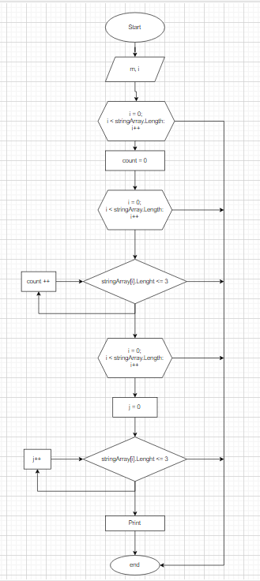

# Задача:
Написать программу, которая из имеющегося массива строк, длина которых меньше либо равна 3 символа. Первоначальный массив можно ввести а клавиатуры, либо задать на старте выполнение алгоритма. При решение не рекомендуется пользоваться, лучше обойтись исключительно массивами.

# *Описание решение задачи*

1 Выводим запрос на ввод размера массива(m).

2 Просим пользователь заполнить элементами массив, с клавиатуры.

3 Задается массив stringArray размером m и элементами i, с помощью метода array.

4 Методом element, проверяем чтобы элементы массива, не вышли за границы длины массива.
Параллелельно проверя условие индекса равно или не больше 3.

Если условие соблюдено, увеличиваем count на один. Если нет - переходим к проверке следующего элемента массива.

Заполняем массив stringArray нужными нам по условию элементами.

5 В методе Print, выводим полученный массив.

# Блок - схема
